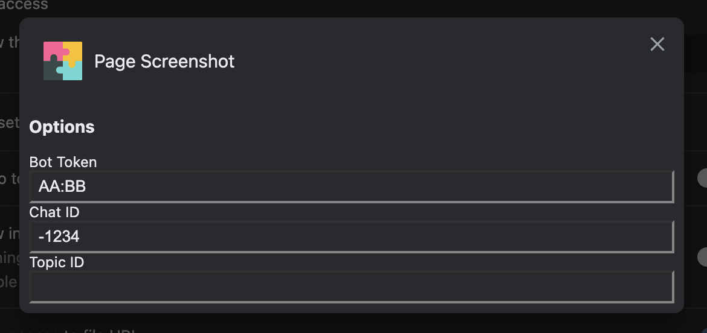

# Page Screenshot

## Description

This is a simple chrome extension to take a screenshot of a webpage and send it
directly to a telegram chat.

## Build

To build the extension, run the following command:

```bash
pnpm run build
```

NB: you need to have [pnpm](https://pnpm.io/) installed. You can install it following <https://pnpm.io/installation>.

## Installation

1. Clone this repository
2. Build the extension (see [Build](#build))
3. Open the Extension Management page by navigating to `chrome://extensions`.
4. Enable Developer Mode by clicking the toggle switch next to Developer mode.
5. Click the LOAD UNPACKED button and select the extension build directory (`distribution/`)

## Usage

1. Open the extension settings page in the chrome extension page under "Page Screenshot" &rarr; "Details" &rarr; "Extension options"

   

2. Insert the telegram bot token

   NB: you can get the token by creating a new bot with the [BotFather](https://t.me/botfather)

3. Insert the telegram chat id

   NB: you can get the chat id by using something like [@username_to_id_bot](https://t.me/username_to_id_bot)

4. Click on the extension icon to take a screenshot of the current page and send it to the telegram chat

## Privacy Policy

No data or personal information is collected by page-screenshot.

### Contact

If you have any questions or suggestions regarding this privacy policy, do not hesitate to [contact us](https://github.com/squadracorsepolito/page-screenshot/issues/new).
